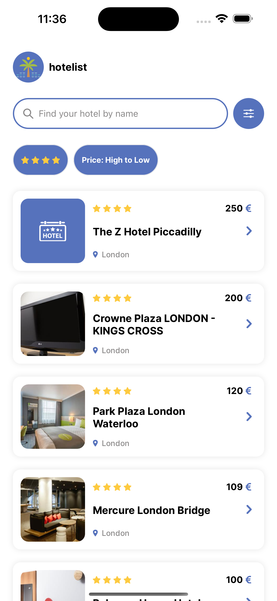
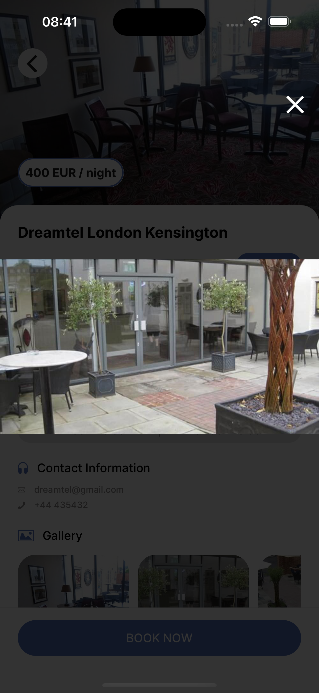

<div align="center">
        
    <h1>
            hotelist
    </h1>
</div>

hotelist is a simple and responsive mobile application built with Expo and React Native that allows users to browse, search, and view details of hotels from a remote API.

## Features

- 🔍 **Search & Filter** – Search hotels by name, filters by hotel rating and order by price, rating, or name.
- 📋 **Hotel List** – View a scrollable list of available hotels with brief info such as name, image, price, location and rating.
- 🧭 **Hotel Details** – Tap on a hotel to see full details including description, photos, location, and contact information.
- ⚡️ **Optimized UI** – Clean and lightweight UI built with performance and usability in mind.

## Tech Stack

- **Frontend**: [React Native with Expo](https://github.com/expo/expo)
- **Client State Management**: [Zustand](https://github.com/pmndrs/zustand)
- **Caching and Server State Management**: [Tanstack Query](https://github.com/TanStack/query)

## Screenshots

<table>
   <tr>
      <td><strong>Home page</strong><br></td>
      <td><strong>Hotel details page</strong><br></td>
   </tr>
   <tr>
      <td><strong>Filter page</strong><br></td>
      <td><strong>Gallery image modal</strong><br></td>
   </tr>
</table>

## Setup instructions (development build)

1. Install dependencies

   ```bash
   npm install
   ```

2. Build the app

   ```bash
    npx expo prebuild --clean
    npm run ios && npm run android
   ```

3. Run the app

   ```bash
    npm run start
   ```

## Setup instructions (Expo Go)

1. Install dependencies

   ```bash
   npm install
   ```

2. Run the app

   ```bash
    npx expo start
   ```

## Run unit tests

```bash
npm run test
```
